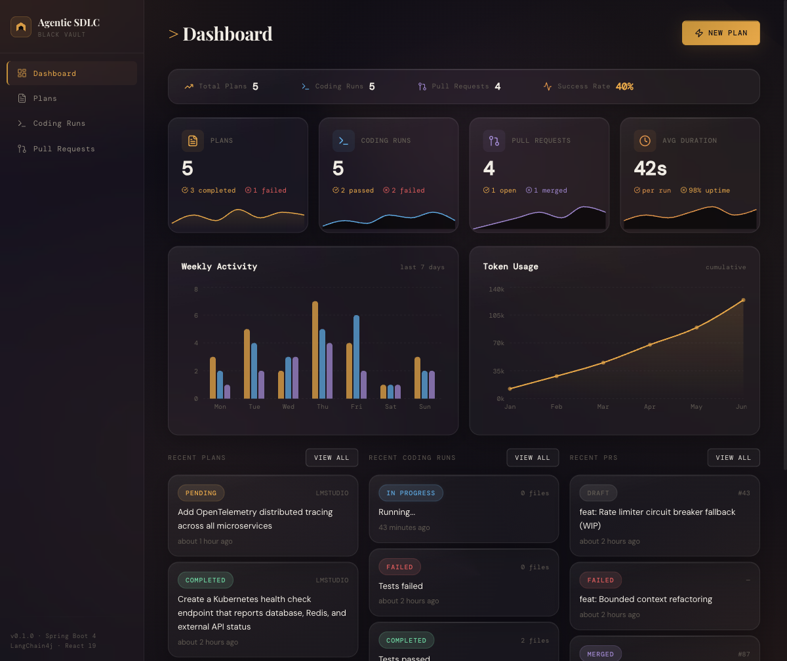
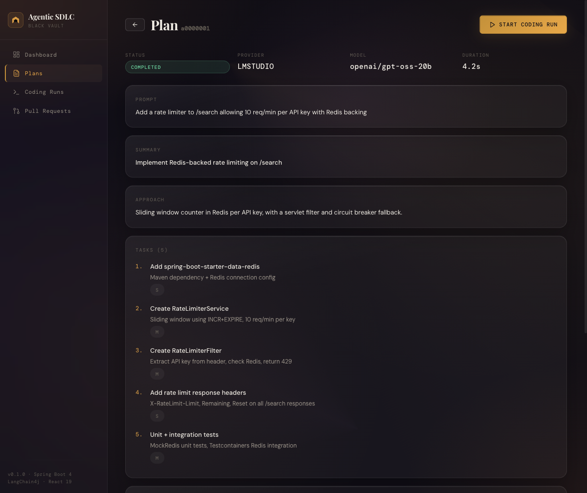
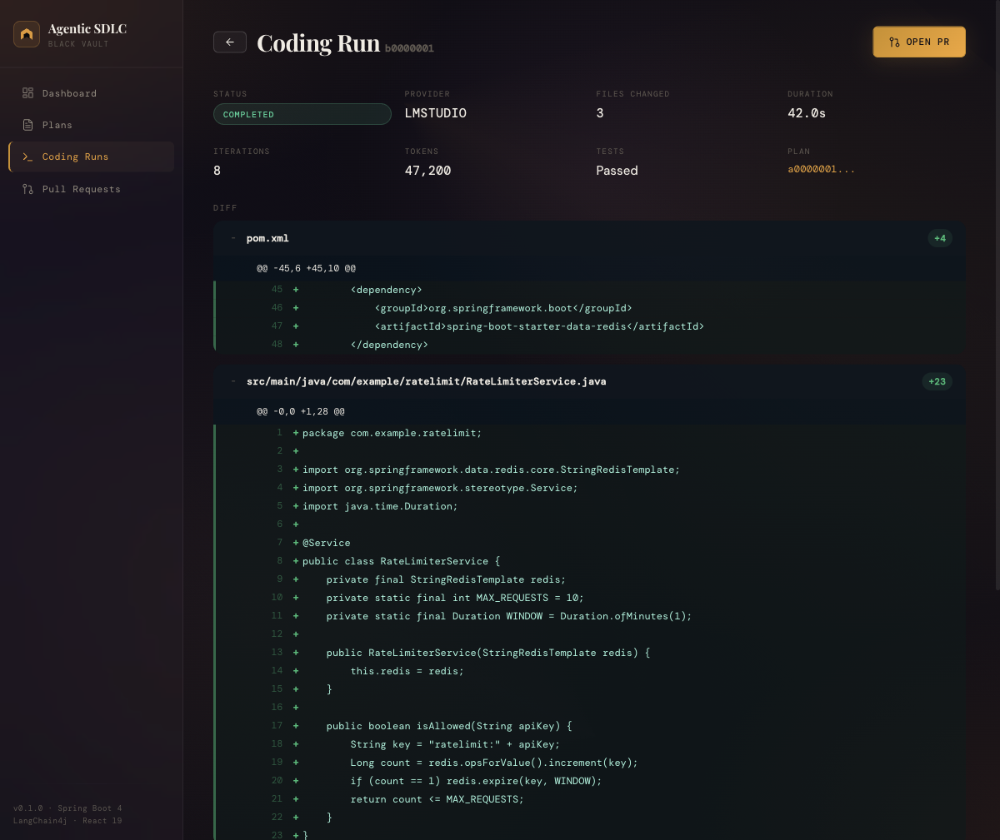
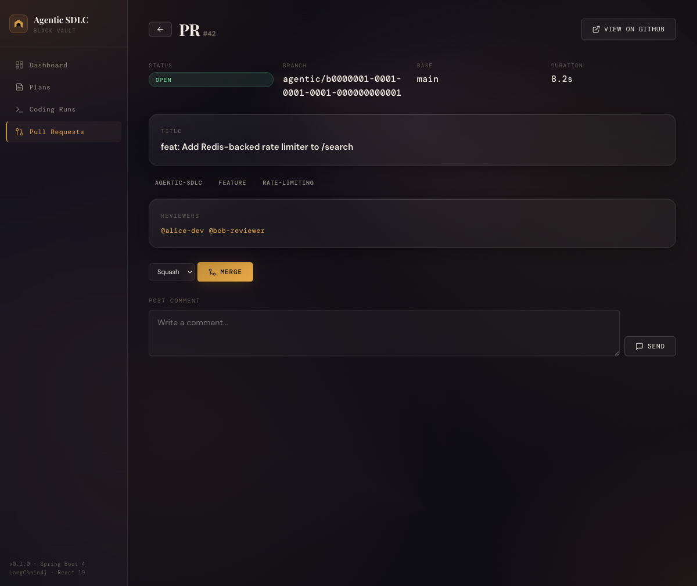
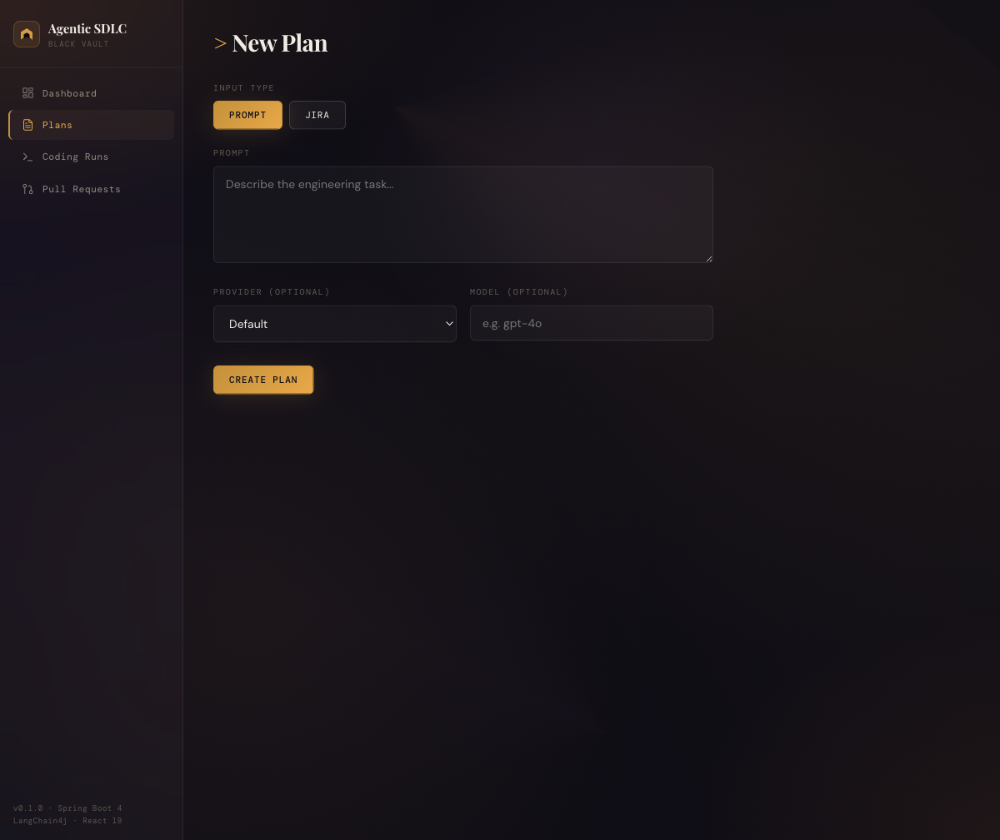

# Agentic SDLC — Autonomous Delivery Platform

> A Spring Boot 4 / Java 21 + React platform that autonomously executes Jira stories end-to-end: reads a ticket, plans the implementation, writes code in a sandboxed Docker container, and opens a GitHub PR — with zero human intervention.

## Screenshots

### Dashboard — stat cards, charts, live pipeline status


### Plan Detail — structured tasks, files to touch, risks, open questions


### Coding Run — iterations, tokens, GitHub-style diff viewer


### Pull Request — labels, reviewers, merge controls, comments


### New Plan — prompt or Jira input mode


---

## What This Does

```
Jira Ticket  ──→  Structured Plan  ──→  Code in Sandbox  ──→  GitHub PR
   (M1)              (LLM)               (Docker + LLM)       (auto-open)
```

**Three milestones, fully implemented:**

| Milestone | What | How |
|-----------|------|-----|
| **M1 — Planning** | Jira ticket or prompt → structured implementation plan | LangChain4j AiServices, structured JSON output, 5 LLM providers |
| **M2 — Coding** | Plan → code changes via autonomous agent | Tool-use loop (`readFile`/`writeFile`/`runCommand`) in ephemeral Docker container |
| **M3 — GitHub PR** | Diff → branch + commit + pull request | PAT or GitHub App auth, CODEOWNERS reviewers, labels, merge, comments |

## Tech Stack

| Layer | Technology |
|-------|-----------|
| **Backend** | Java 21, Spring Boot 4.0.3, LangChain4j 1.12.1 |
| **Frontend** | React 19, Vite 6, TypeScript, Recharts, Playfair Display + DM Mono |
| **LLM Providers** | OpenAI, Anthropic, AWS Bedrock, Ollama, LM Studio |
| **Database** | PostgreSQL 16, Flyway migrations, Hibernate 6 JSONB |
| **Containers** | Docker (coding sandbox), docker-compose (full stack) |
| **GitHub** | kohsuke/github-api, PAT + App auth, Spring Retry |
| **Observability** | OpenTelemetry (OTLP), Micrometer, Prometheus |
| **Testing** | JUnit 5, Mockito, AssertJ, WireMock, Testcontainers |

## Quick Start

```bash
cp .env.example .env    # Enable at least one LLM provider
docker compose up --build

# Frontend:  http://localhost:3000
# API:       http://localhost:8088
# Swagger:   http://localhost:8088/swagger-ui.html
```

See **[How to Run](docs/how-to-run.md)** for detailed setup instructions, provider configuration, and usage examples.

## Documentation

| Document | Description |
|----------|-------------|
| **[Architecture](docs/architecture.md)** | System design, vertical slices, data flow, design decisions |
| **[How to Run](docs/how-to-run.md)** | Prerequisites, Docker setup, provider config, API examples, testing |
| **[Roadmap](docs/roadmap.md)** | Planned enhancements, future milestones, architecture improvements |

## API Endpoints

### Plans (M1)
| Method | Path | Description |
|--------|------|-------------|
| `POST` | `/api/v1/plans` | Create a plan from prompt or Jira ticket |
| `GET` | `/api/v1/plans/{id}` | Get plan detail with full structured output |
| `GET` | `/api/v1/plans` | List plans (paginated) |

### Coding Runs (M2)
| Method | Path | Description |
|--------|------|-------------|
| `POST` | `/api/v1/coding-runs` | Start autonomous coding run (202 async) |
| `GET` | `/api/v1/coding-runs/{id}` | Poll run status + result |
| `GET` | `/api/v1/coding-runs/{id}/diff` | Raw diff output |
| `GET` | `/api/v1/coding-runs` | List runs (paginated) |

### Pull Requests (M3)
| Method | Path | Description |
|--------|------|-------------|
| `POST` | `/api/v1/pull-requests` | Create PR from coding run (202 async) |
| `GET` | `/api/v1/pull-requests/{id}` | PR detail with labels, reviewers, status |
| `GET` | `/api/v1/pull-requests` | List PRs (paginated) |
| `POST` | `/api/v1/pull-requests/{id}/ready` | Mark draft as ready for review |
| `POST` | `/api/v1/pull-requests/{id}/merge` | Merge PR (squash/merge/rebase) |
| `POST` | `/api/v1/pull-requests/{id}/comments` | Post comment on PR |

## Project Layout

```
├── frontend/                    React dashboard (Vite + TypeScript)
├── src/main/java/.../
│   ├── planning/                M1: Jira/prompt → structured plan
│   │   ├── api/                 PlansController + DTOs
│   │   ├── domain/              PlanningService + PlanningAgent interface
│   │   ├── agent/               LangChain4j AiServices implementation
│   │   └── persistence/         PlanRecord + PlanRepository
│   ├── coding/                  M2: Plan → code via agentic loop
│   │   ├── api/                 CodingRunsController + DTOs
│   │   ├── domain/              CodingService + CodingAgent + CodeExecutor
│   │   ├── agent/               Tool-use loop (@Tool readFile/writeFile/etc)
│   │   ├── executor/            DockerCodeExecutor (sandboxed container)
│   │   └── webhook/             RestWebhookClient (fire-and-forget)
│   ├── github/                  M3: Diff → branch + PR
│   │   ├── api/                 PullRequestsController + DTOs
│   │   ├── domain/              PullRequestService + GitHubClient
│   │   ├── auth/                PAT + GitHub App (kohsuke client)
│   │   ├── pipeline/            DockerDiffApplier + CodeownersResolver
│   │   └── persistence/         PullRequestRecord + repository
│   ├── llm/                     Shared: multi-provider ChatModel factory
│   ├── jira/                    Shared: Jira REST client
│   └── observability/           Shared: OTel + Micrometer wiring
├── docs/
│   ├── architecture.md          System architecture
│   ├── how-to-run.md            Setup + usage guide
│   └── roadmap.md               Planned enhancements + future milestones
└── docker-compose.yml           Full stack: app + frontend + postgres + otel
```

## Testing

87 unit tests across all three milestones:

```bash
./mvnw test -Dtest='!PlanRepositoryTest,!PlansControllerIT,!CodingRunsControllerIT'
```

| Test Suite | Tests | Coverage |
|-----------|-------|----------|
| Planning (M1) | 29 | Service, controller validation, exception handler, record transitions |
| Coding (M2) | 24 | Service orchestration, budget enforcement, tool-use, record, controller |
| GitHub (M3) | 34 | PR service, CODEOWNERS parsing, config validation, record, controller |

## License

MIT
